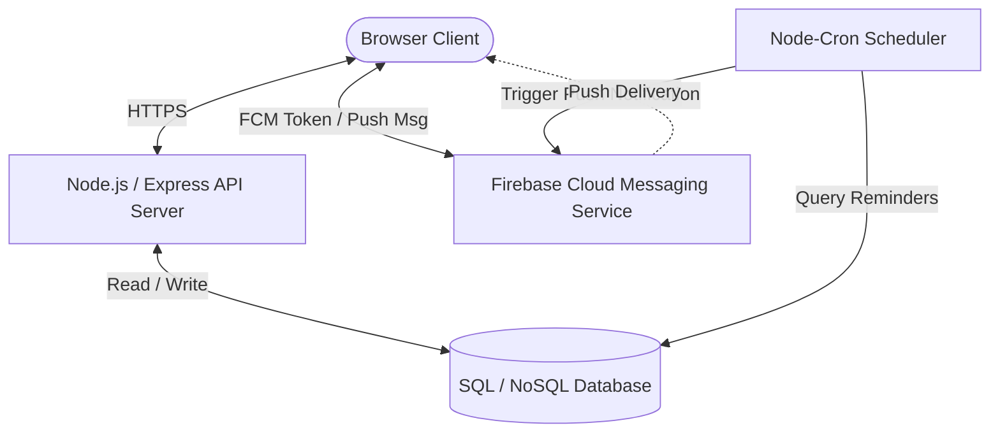

# Tabibak — Architecture and Deployment Guide

Tabibak is a modern AI-powered Virtual Medical Triage Assistant and Medication Reminder application. This document details the refactored architecture, database schemas, APIs, scheduled tasks, and deployment procedures after removing all Telegram and n8n integrations and replacing them with **Firebase Cloud Messaging (FCM)**.

---

## 1. System Architecture Diagram



---

## 2. Updated Database Schema

To support medication reminders using FCM push notifications instead of Telegram/n8n, the following database configurations are required in your persistent database layer:

### Users Table / Collection
Stores authentication, profile details, and device-specific notification tokens.

```javascript
// DATABASE REQUIRED
// Store FCM token here
// Schema for the 'users' collection/table
{
  username: "johndoe",          // Unique identifier
  passwordHash: "bcrypt_hash",  // Hashed password
  name: "John Doe",             // Full name
  age: 30,                      // Age
  gender: "Male",               // Gender
  mobile: "+12345678900",       // Contact number
  history: "No allergies",      // Medical history notes
  fcmToken: "fcm_token_string"  // Token issued by FCM client SDK to deliver push notifications
}
```

### Medications Table / Collection
Stores the schedule of medications and their doses for each user.

```javascript
// DATABASE REQUIRED
// Store medication reminder schedule
// Schema for the 'medications' collection/table
{
  id: "medication_uuid",       // Unique medication identifier
  username: "johndoe",         // Reference to owner in 'users'
  name: "Aspirin",             // Medication name
  dose: "100mg",               // Dose amount
  form: "Pill",                // Form factor (Pill, Liquid, Injection, etc.)
  food: "Before food",         // Intake condition relative to meals
  doses: [                     // Array of daily dose times
    { time: "08:00" },
    { time: "20:00" }
  ],
  urgent: false,               // Urgent flag status
  note: "Take with water",     // Optional patient notes
  icon: "pill",                // Icon label for UI rendering
  color: "#0d9488"             // Theme color for UI rendering
}
```

---

## 3. Core API Endpoints

The backend server exposes the following RESTful API endpoints for user accounts and medication scheduling:

### `POST /api/auth/register`
Creates a new user profile.
* **Request Payload**:
  ```json
  {
    "username": "johndoe",
    "password": "securepassword",
    "name": "John Doe",
    "age": "30",
    "gender": "Male",
    "mobile": "+12345678900",
    "history": "None"
  }
  ```
* **Response**: `201 Created` with JWT authentication token.

### `POST /api/auth/login`
Authenticates user and returns user profile.
* **Request Payload**:
  ```json
  {
    "username": "johndoe",
    "password": "securepassword"
  }
  ```
* **Response**: `200 OK` with JWT authentication token and profile.

### `POST /api/notifications/store-token`
Receives and updates the user's FCM push token in the database.
* **Request Header**: `Authorization: Bearer <JWT_TOKEN>`
* **Request Payload**:
  ```json
  // FCM TOKEN STORAGE
  {
    "username": "johndoe",
    "fcmToken": "fcm_token_string_from_firebase_sdk"
  }
  ```
* **Response**: `200 OK`
  ```json
  { "status": "success", "message": "FCM registration token stored successfully." }
  ```

### `POST /api/medications`
Saves a new medication schedule to the database.
* **Request Header**: `Authorization: Bearer <JWT_TOKEN>`
* **Request Payload**:
  ```json
  {
    "username": "johndoe",
    "name": "Aspirin",
    "dose": "100mg",
    "form": "Pill",
    "doses": [{ "time": "08:00" }, { "time": "20:00" }],
    "food": "Before food",
    "urgent": false,
    "note": "Take with water"
  }
  ```
* **Response**: `201 Created`
  ```json
  { "status": "success", "message": "Medication schedule saved." }
  ```

---

## 4. Cron Jobs / Scheduled Tasks (Reminders Process)

A scheduled background runner queries the database to find medications scheduled for intake. When a match is found, it sends an FCM push message to the user's device.

### Node-cron Implementation Pattern
This scheduled runner is hosted on the API server or as a background service worker process:

```javascript
// CRON JOBS / SCHEDULED TASKS
// Scheduled task running every 5 minutes to verify and deliver medication reminders
const cron = require('node-cron');
const admin = require('firebase-admin');
const db = require('./database'); // Database driver wrapper

// Initialize Firebase Admin SDK using your service account credentials
// FIREBASE CONFIGURATION
admin.initializeApp({
  credential: admin.credential.cert(require('./firebase-adminsdk-key.json'))
});

cron.schedule('*/5 * * * *', async () => {
  console.log('[Cron Job] Checking upcoming medication reminders...');
  
  // Get current time details
  const now = new Date();
  const currentHourMin = now.toTimeString().substring(0, 5); // Format: "HH:MM"
  
  try {
    // 1. Fetch medications that have a dose scheduled matching the current time
    // DATABASE REQUIRED
    // Query medication reminder schedules matching current scheduled hour-minute slot
    const reminders = await db.queryMedsByTime(currentHourMin);
    
    for (const reminder of reminders) {
      // 2. Fetch the corresponding user's FCM token from database
      // DATABASE REQUIRED
      // Fetch user profile linked to the medication's username to get the FCM token
      const user = await db.getUserByUsername(reminder.username);
      
      if (user && user.fcmToken) {
        // NOTIFICATION DELIVERY LOGIC
        // Construct the FCM notification payload
        const message = {
          notification: {
            title: `💊 Medication Reminder: ${reminder.name}`,
            body: `Hi ${user.name}, it is time to take your dose of ${reminder.name} (${reminder.dose}).`,
            icon: 'https://cdn-icons-png.flaticon.com/512/1930/1930985.png'
          },
          data: {
            medicationId: String(reminder.id),
            click_action: 'FLUTTER_NOTIFICATION_CLICK' // Or website landing URL
          },
          token: user.fcmToken // Device recipient token
        };

        // 3. Deliver push notification via FCM Admin SDK
        try {
          const response = await admin.messaging().send(message);
          console.log(`[Push Notification] Successfully sent to user ${user.username}. FCM ID: ${response}`);
        } catch (fcmError) {
          console.error(`[Push Notification] Error delivering message to token ${user.fcmToken}:`, fcmError);
          // If FCM returns an invalid registration error, clear the stale token from DB
          if (fcmError.code === 'messaging/invalid-registration-token' || fcmError.code === 'messaging/registration-token-not-registered') {
            await db.clearFcmToken(user.username);
            console.log(`[Push Notification] Stale FCM token removed for user ${user.username}`);
          }
        }
      }
    }
  } catch (dbError) {
    console.error('[Cron Job] Database retrieval failure:', dbError);
  }
});
```

---

## 5. Deployment Instructions

### 5.1. Firebase Configuration Setup
1. Visit the [Firebase Console](https://console.firebase.google.com/) and create a project named **Tabibak**.
2. Navigate to **Project Settings** > **Cloud Messaging**.
3. Under **Web configuration**, generate a key pair in the **Web Push certificates** section. This is your **VAPID Key**.
4. Navigate to **Project Settings** > **General** > **Your apps** and add a **Web App** to generate your client Firebase Credentials config object:
   ```javascript
   const firebaseConfig = {
     apiKey: "YOUR_API_KEY",
     authDomain: "YOUR_PROJECT_ID.firebaseapp.com",
     projectId: "YOUR_PROJECT_ID",
     storageBucket: "YOUR_PROJECT_ID.appspot.com",
     messagingSenderId: "YOUR_MESSAGING_SENDER_ID",
     appId: "YOUR_APP_ID"
   };
   ```
5. Go to **Project Settings** > **Service accounts** and click **Generate new private key**. Download the JSON key file, rename it to `firebase-adminsdk-key.json`, and place it in your backend workspace directory for the cron server.

### 5.2. Service Worker File Setup
To handle background messages when the app is closed, the browser fetches `firebase-messaging-sw.js` relative to the root origin.
1. Place [firebase-messaging-sw.js](file:///c:/Users/moham/OneDrive/Desktop/tabibak/tabibak/firebase-messaging-sw.js) directly in the root static directory of your frontend server.
2. Ensure you update `firebaseConfig` variables in both [tabibak.html](file:///c:/Users/moham/OneDrive/Desktop/tabibak/tabibak/tabibak.html) and [firebase-messaging-sw.js](file:///c:/Users/moham/OneDrive/Desktop/tabibak/tabibak/firebase-messaging-sw.js).

### 5.3. HTTPS Protocol Requirement
* Browser notification permissions and FCM registration APIs require a **secure context (HTTPS)**.
* During local development, the app works on `http://localhost` or `http://127.0.0.1`.
* For staging and production, you must serve the frontend web page and backend server endpoints behind an SSL certificate (e.g. using Let's Encrypt or Cloudflare CDN proxies).
